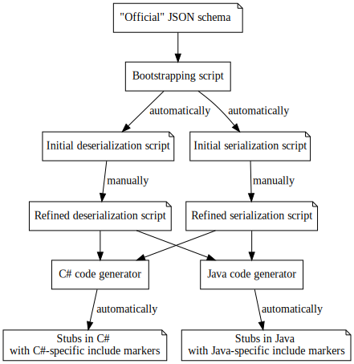

# De/serialization Scripts

For many similar languages following the procedural paradigm, it is tedious to write the deserialization over and over again.
For example, once we implemented the deserialization of JSON in C#, it will be most probably the same thing in Java, and very similar in Golang.

(*2021-03-26: Functional languages are an exception here, but that is a problem we abstract away at the moment.*)

Instead, we propose to specify the de-serialization and serialization in a meta-language as a **de/serialization script**.
A de/serialization script is then **transpiled** by the [code generators] into the respective implementation of the library.

[code generators]: general-design-decisions.md#code-generators

## Scripting Language

We use a subset of Python language to script the de/serialization.

As the de/serialization scripts are not used by the wide audience, but only by the developers of the library, we intentionally decide on-the-go which Python features to support.
Hence we only transpile a very limited subset of builtin functions and types.
For example, we allow no nested functions, classes or context managers.

### Operations

Each **de-serialization and serialization operation** is given as a **function**.
The function operates on a `jsonable`, the corresponding object to which the parsed data should be added and a path to the JSON-able.

For example `parse_submodel_element`:

```python
def parse_submodel_element(
        jsonable: object,
        submodel: Submodel,
        path: pathlib.Path) -> None:
    ...
```

### Provided Commands and Queries

It is assumed that the de/serialization script can **access the operations and the data structures of our library** (such as `Submodel` in the aforementioned example).

Additionally, special commands and queries such as `is_int32`, `is_int64`, …, `as_int32`, `as_int64`, `as_float32`, `as_float64`, `as_list` and `as_map` are provided to implement the logic.
Functions such as `x = local_int32(0)` are used to instantiate local variables.
These special commands and queries are implemented in a separate module, say, `aasx_core_gen.de_serialization`.

### Supported Language Constructs

For-loops can loop either over lists, over maps or over `for _ in range(..., ...)` where both start and end are given as integers.

### Error Messages

The errors should be reported using pre-defined functions `error(message: str, path: pathlib.Path)`.

The messages should use [old string formatting] to allow for easier transpilation to languages such as C++ and Golang.

[old string formatting]: https://docs.python.org/3/library/stdtypes.html#old-string-formatting

### Include Markers

Since we only provide a transpilation based on a subset of Python language, many operations will have to include manually defined code snippets.
The developer should mark such spots with [include markers] using `NotImplementedError`.
For example:

```
raise NotImplementedError('some-marker')
```

will make the [code generators] introduce an include marker `some-marker` in the generated code.
The [filler script] will eventually replace the [include markers] with the corresponding code snippets written in the implementation language.

[include markers]: general-design-decisions.md#include-markers
[filler script]: general-design-decisions.md#filler-script

## Relation to [JSON Schema] and [XML Schema Definition]

[JSON Schema]: https://json-schema.org/
[XML Schema Definition]: https://en.wikipedia.org/wiki/XML_Schema_(W3C)

We should write a separate code generator to bootstrap this scripting code based on a schema (*e.g.*, a [JSON Schema]), but the schema should not be referenced in the meta-model nor available directly in code.
There are two reasons for this decision:

* Validation and parsing of the input needs **complex logic**.
   We need to support dialects or instantiate different objects based on a complex logic.
  This is not possible to define in a schema.

* The generated implementation does not depend on a schema.
  Few languages support [JSON Schema] and [XML Schema Definition] out-of-box.
  The schema libraries, if available, tend to be slow and buggy (in general).

When the "official" schema changes, we need to manually update our code.
For example, we could use the bootstrapping code generator to re-generate the code based on the new schema and inspect the changes with the [diff] tool.
This is clearly tedious, but we found no easy way around it.

[diff]: https://en.wikipedia.org/wiki/Diff





## Implementation Considerations

### Error logging

Error logging is more involved than it seems at first.
We probably need to cap the maximum number of errors — once the error log is full, the parsing should be immediately stopped.
This can be implemented by passing an `ErrorLog` to `parse_*` functions.
As error logs are capped, the generated code should automatically check for available capacity at certain points (e.g., before descending into parsing the child elements), and abort the parsing if the capacity has been reached.
This might also have implications on efficiency — but so do exceptions and stack unwinding!

We might consider making two variants of `parse_*` functions — one with ErrorLog and one without (which raises the exceptions).
The latter, which raises the exceptions, uses the first variant and passes an `ErrorRaiser` (or `ErrorThrower`, depending on the language) as `ErrorLog`.

### Bugs with Floats and Integers

JSON specifies that all numbers (both integers and floats) are given as 64-bit floating point numbers (see [this comment on a GitHub issue]).
Most JSON libraries will thus handle all numbers as 64-bit floats.
This can lead to hard-to-spot bugs when the files are deserialized.

[this comment on a GitHub issue]: https://github.com/grpc-ecosystem/grpc-gateway/issues/438#issuecomment-330742999


Here is a Python snippet to illustrate the unexpected behavior:

```python
import json

# Mind the last digit before the comma!
>>> json.loads('9007199254740993.0')
9007199254740992.0
```

Similarly, in Golang:

```go
package main

import (
	"encoding/json"
	"fmt"
)

func main() {
	var x interface{}
	json.Unmarshal([]byte("9007199254740993"), &x)

	xFloat64 := x.(float64)

	fmt.Printf("x is %f\n", xFloat64)
}
```

will give you: `x is 9007199254740992.000000` (again, mind the last digit).

While we can not fix the de-serialization, as we usually rely on the built-in library, we could at least raise an exception during the serialization.
For example, if we are serializing an 64-bit integer to JSON, we need to ensure that it is less-equal 2^52 (see again [this comment on a GitHub issue]).

While the issue seems rare and irrelevant, that is not the case in the practice.
All data structures that involve unique identifiers given as 64-bit integer numbers will exhibit the bug if they do not increment the identifiers consecutively, but generate random 64-bit identifiers.

### Functional languages

We probably don't need a different scripting language for purely functional languages, but we need to think hard about it.
At this stage, let us cover the procedural languages, and then think about how we can generate code for functional languages, and observe only then what walls we hit.

### Debugging

There should be a flag in the [code generators] to allow for inclusion of the original scripts in the generated code as comments.
Thus the generated code is easier to trace and double-check.
