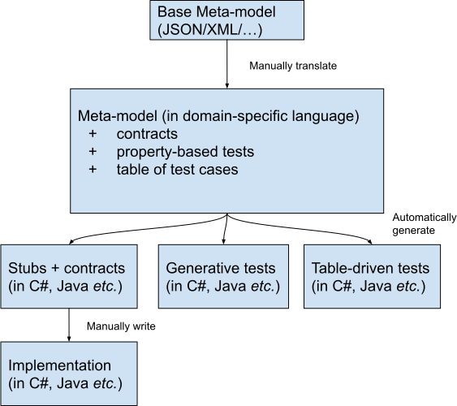

# General Design Decisions

## Mission

We want to provide a library for manipulating the static information of the [asset administration shell] with a unified interface and implementations in many programming languages.

[asset administration shell]: https://www.plattform-i40.de/PI40/Redaktion/DE/Downloads/Publikation/Details_of_the_Asset_Administration_Shell_Part1_V3.html

## Scope

The library covers the data model of the shell and its serialization.

We aim to implement the library at the level of quality **ready for production**.

We embrace **stability** and **long-term support** instead of  **experimental features**.

The library should be **minimalistic** (as opposed to large  enterprise systems).

The library should provide base for a rich **toolkit** built on top of it.
For example, generators such as aasx-to-grpc or aasx-to-opc-ua-server.

## Out-of-Scope

* The **component manager**, the "active" part of the shell, is out-of-scope.

  This is the responsability of other components such as [aasx-server].

* The **thread-safe operations** and **ACID transactions** are out-of-scope.

  The locking as well as write-ahead logs are left to the user.
  A different library, aasx-db (yet to be created), will provide such functionality.

* We expect the data model of an [asset administration shell] to **fit in memory**.

  Otherwise, components such as [aasx-server] and aasx-db (yet to be created) should be used.

* Since **query language** has not been standardized yet, we will not implement it at this point (March 2021).

  The library should provide basic quering through dedicated operations based on the existing implementations, such as the data model of the [AASX Package Explorer].

[aasx-server]: https://github.com/admin-shell-io/aasx-server
[AASX Package Explorer]: https://github.com/admin-shell-io/aasx-package-explorer

## Requirements

* The library should be provided in **many programming languages**.

* We aim for **unified interface** shared between the languages.
Thus the users which use multiple languages can use the library effortlessly between them, as the interface remains familiar.

* The **main user base** are the developers working on **stable production systems**.
  However, the library should be **flexible enough** to allow **experimenters** to use it in their experimental code bases.

* Certain **patterns** should be supported out-of-the-box.
  For example, code for visitors and transformers should be included.

* The library should **minimize the dependencies** to avoid the dependency hell and be runnable on as many systems as possible.

* The implementations should be in **native code** (instead of wrapping, say, C++ code).
 This allows language-specific power features such as reflection.

* The library should provide read/write operations on **AASX files**.
  This means that blobs and packaged files should be readable/writable, but no additional features on the blobs should be made available.

* The library should provide **import/export for JSON and XML**.
  Other formats such as AutomationML and RDF are not supported out-of-the-box.
  However, adding imports and exports for additional formats should be straightforward, so that users can develop their own import/export libraries on the top.

  We should explicitly track how much friction there is if the user wants to use RDF, AML or any other serialization format.

    * For example, can the user just load an AASX and use RDF?
    * Is there a hook to set up so that the user can choose which serialization methods should be supported?

* The generated code should allow for **static analysis** as much as possible.
  For example, [Nullable types] should be used wherever appropriate.

[Nullable types]: https://en.wikipedia.org/wiki/Nullable_type

* We should support **wide range of computer architectures**.
  For example, we need to support [Mono] in C# so that the library can run on ARM32 machines.
  This is important as embedded systems often run on such machines.

[Mono]: https://www.mono-project.com/

* We need to support the **Environment (multiple shells)**, but not the shell repository.

  You should be able to implement the repository using our library, but our library does not care about the repository.

* We **postpone** the discussion about **the middlewares**.

  For example, it would be practical if we allowed for a middleware to resolve ecl@ss automatically.
  However, this is not trivial and we leave this out at the moment (2021-03-26).

* The user **should not use constructors** to create objects.

  We want to keep migrations between aasx-core and aasx-db (its thread-safe pendant based on transactions) as effortless as possible.
  Since aasx-db is an *object-oriented database*, it needs to keep track of the objects and their state.
  Therefore, constructors need to be handled through factory methods to prepare for a future migration to aasx-db.

* **Computational efficiency** is important.
  The library will be used in large batches as well as servers which need to have large throughput.

## Development Workflow

We write a [meta-model] once and generate code stubs for the individual languages using [code generators].
The developer fills in the stubs manually.

This allows us to scale fast between languages.
Additionally, when the specification of the [asset administration shell] changes, the [meta-model] allows us to react much faster.

[meta-model]: #meta-model
[code generators]: #code-generators



## Meta-model

The meta-model is written in [RDF SHACL].

[RDF SHACL]: https://www.w3.org/TR/shacl/

The meta-model specifies:
* [Data Structures and Operations],
* [Contracts] of the operations, and
* [De/serialization scripts].

[Data Structures and Operations]: data-structures-and-operations.md
[Contracts]: contracts.md
[De/serialization scripts]: deserialization-scripts.md

Schemas such as [JSON Schema] and [XML Schema Definition] are not powerful enough as we can not specify the operations and corresopnding contracts.

[JSON Schema]: https://json-schema.org/
[XML Schema Definition]: https://en.wikipedia.org/wiki/XML_Schema_(W3C)

The meta-model needs to allow for something akin to [traits],  [mixins] or [multiple inheritance] so that common structures are re-used.
For example, `Identifiable` is one such trait which is used throughout the meta-model.

[traits]: https://en.wikipedia.org/wiki/Trait_(computer_programming)
[mixins]: https://en.wikipedia.org/wiki/Mixin
[multiple inheritance]: https://en.wikipedia.org/wiki/Multiple_inheritance

## Code generators

We develop a code generator for each programming language separately.
A code generator takes the [meta-model] as input and generates the stub of the library:
* A code generator **generates** the interfaces and data structures based on the meta-model.
* A code generator **transpiles** the [contracts] as well as [JSON de/serialization scripts] to the corresponding implementation language.

The developer needs to fill in the stubs to finalize the library.

### Include Markers

The generated stubs contain **include markers** which specify parts of the code that need to be filled in.
<a name="filler-script"></a>
A **filler script** is provided to replace the include markers with the corresponding code snippets.

Each include marker is globally uniquely identified.

TODO (mristin, 2021-03-26): Draw a diagram here meta-model 🠒 code generator 🠒 stubs 🠒 filler (with snippets as inputs); DRAW ON PAPER FIRST!

(*mristin 2021-03-26: It remains to be seen if we need a filler script per language, or one for the whole library.*)

## Versioning

The base name is `aasx-core`.

We use the schema:

```
aasx-core{AAS version}-{language version}-{optional runtime version}
```

For example:
* `aasx-core2-java15` is the aasx-core library supporting the specification of the [asset administration shell] version 2 and Java 15.
* Analogously, `aasx-core3-csharp8-dotnet5` is the aasx-core library supporting the specification of the [asset administration shell] version 3, C# version 8 and the runtime .NET 5.

We follow [Semantic Versioning] for the versioning of the library.
The version X.Y.Z indicates:

* X is the major version (backward-incompatible),
* Y is the minor version (backward-compatible), and
* Z is the patch version (backward-compatible bug fix).

[Semantic Versioning]: http://semver.org/spec/v1.0.0.html

Here is an example of a full identifier: `aasx-core5-python38 1.43.4`.

