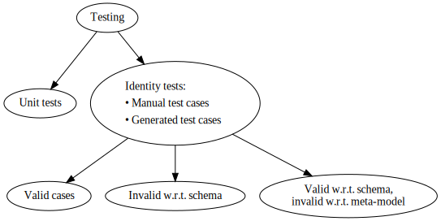

# Testing

We perform two kinds of testing:

* **Unit tests**, which test the individual operations, and
* **Identity tests**, which test the de/serialization. 



## Scripted Unit Tests

Since we develop in a polyglot setting, the logic of most of the unit tests will be the same across the languages.
Therefore we script those unit tests in a common language.
 Similar to [de/serialization scripts], we generate the implementations in the respective languages based on these unit test scripts.

[de/serialization scripts]: deserialization-scripts.md

We will initially use a subset of Python.
We do not know at this point (2021-03-27) which language features we need nor what constructs we need to support.
It is also possible that we can script tests using even a simpler language (*e.g.*, a chain of JSON objects describing the actions).
Hence it remains to be further discussed how this scripting of unit tests should be implemented.

## Identity Tests

To establish the correctness of the de-serialization, contracts and serialization, we test for identity.
The serialization of the de-serialization of an input should give you the very same input.
 Formally:
 ```
serialize(deserialize(input)) == input
```

All valid test cases should satisfy this property.

All invalid test cases should report one or more errors in the test.

### Manual Test Cases

We collect different test cases as JSON and XML files.
The test cases include multiple examples of:

* File represents a valid shell,
* File is invalid according to the schema,
* File is valid according to the schema, but represents an invalid shell.

We also need special test cases to account for [bugs related to how JSON handles numbers].

[bugs related to how JSON handles numbers]: deserialization-scripts.md#bugs-with-floats-and-integers

### Generated Test Cases

Manually constructing shells is tedious and we will almost certainly miss many edge cases.
Therefore we turn to automatic generation of test cases to increase the test coverage.

#### Valid

We script the generation of valid cases in Python by using [Hypothesis] library and serialize the generated shells to JSON and XML (using our library).

[Hypothesis]: https://hypothesis.readthedocs.io/en/latest/

#### Invalid w.r.t. Schema

We randomly erase required parts or flip the types of the JSON schema.
 Using such a defect JSON schema we generate the invalid data automatically by sampling with [hypothesis-jsonschema].
This generates the cases which are invalid with respect to schema.

[hypothesis-jsonschema]: https://pypi.org/project/hypothesis-jsonschema/

#### Invalid w.r.t. Meta-model

Automatically generating cases which are valid according to the schema, but invalid w.r.t. meta-model is hard as we can never be sure of the correctness of our de-serialization and contracts.

Therefore we generate JSON data using [hypothesis-jsonschema] and manually inspect the failing examples.
This will help us debug our de-serialization and contracts a bit.

Since inspecting the passing examples is too laborious, we consciously miss all false positives (invalid shell, but passed de-serialization and contracts).
We hope that manually constructed test cases make up for this deficiency in automatically generated cases.

### Test Sets

Depending on the maturity of the change, we use different test sets:

* **Small**, on every **commit**. 
  A selected suit of manual test cases + 100 auto-generated ones.

* **Medium**, on every **alpha release**. 
  All manual test cases + 1000 auto-generated ones.

* **Large**, on every **release**. 
  All manual test cases + 1,000,000 auto-generated ones.

The auto-generated tests are generated only once and "frozen".
